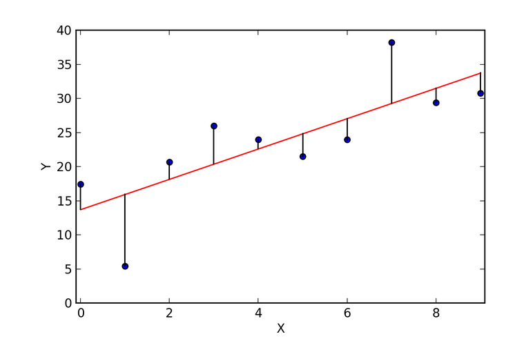

```{r setup, include=FALSE}
knitr::opts_chunk$set(echo = TRUE,warning=FALSE,message=FALSE)
```

# Prediction  Intervals (PIs)

## Prediction Intervals (PIs)

* $\hat{y} = \hat{\alpha} + \hat{\beta} x$ is also 
our prediction of a _future_ $y$ at $x$.

* Future $y$'s consist of the population parameter $\mu_{y|x}$
**plus** a random error.
* The CI is an interval that estimates 
the parameter $\mu_{y|x}$.
* In contrast, a PI is an interval that predicts $\mu_{y|x}$ **plus** a random error and so should be wider (more variable) than the CI.

* To construct an interval that contains, say, 95\% of all future
$y$'s, we need to account for 2 sources of variation:
    1. variation in $\hat{\mu}_{y|x}=\hat{\alpha}+\hat{\beta}x$, and
    2. variation in $\epsilon$.

* As a result of the extra-variation due to $\epsilon$ in 2 above, over and above the variation in $\hat{\mu}_{y|x}$ in 1 accounted for by the CI, the
PIs are wider than CIs.

##

\bigskip

* A level-$C$ PI has the usual form of
    $${\rm estimate} \pm {\rm margin} \; {\rm of} \; {\rm error},$$ where
    + the estimate is $\hat{y}$, and
    + the margin of error is $SE({\rm pred})$ times $t^*$,  
    the upper $(1-C)/2$-critical value of the $t$-distribution
with $n-2$ df.
    
    
* The PI is of similar form to the CI
for $\mu_{y|x}$, except that $SE(\hat{y})$ is replaced with the larger **standard error of prediction**, $SE({\rm pred})$.
    + The text, page 430, provides the formula, which we'll skip. (Text's notation 
    for $SE({\rm pred})$ is $\widehat{se}(\tilde{y})$).

## 95% CIs and PIs for example data

\scriptsize

```{r,echo=FALSE}
uu <- url("http://people.stat.sfu.ca/~jgraham/Teaching/S305_17/Data/lbwt.csv")
lbwt <- read.csv(uu) #load the data
lfit <- lm(headcirc ~ gestage,data=lbwt) #fit the regression model
lpred <- predict(lfit,interval="confidence") #get the 95% CI
#Now make a dataframe of the results
lbwtFits <- data.frame(gestage=lbwt$gestage,lpred) 
lpredPI <- predict(lfit,interval="prediction")
lbwtPreds <- data.frame(gestage=lbwt$gestage,lpredPI)
```

\normalsize

* Predicted values $\hat{y}$ and
lower and upper limits of PI are in
the columns `fit`, `lwr` and `upper`, respectively.
* PIs are wider than CIs; e.g. in the low birth-weight babies data $\ldots$

95% CI for the mean head circumference at gestational age 29 weeks is (26.22, 26.85) cm: 

\scriptsize
```{r, echo=FALSE}
lbwtFits[1,] #95% CI for 1st baby
```
\normalsize

95% PI for the head circumference at gestational age 29 weeks is (23.36, 29.71) cm:
\scriptsize 
```{r, echo=FALSE}
lbwtPreds[1,] #95% PI for 1st baby
```


# $r^2$ in Simple Linear Regression

## Coefficient of determination 

* In simple line regression, the squared Pearson correlation, $r^2$, is
called the _coefficient of determination_
* $r^2$ reflects how close the data are to the regression line.

* Specifically, $r^2$ is the fraction of the variation in the values of
$Y$ that is explained by the least-squares regression of $y$ on $x$;
    + i.e. $r^2=$ explained variation/total variation. 
* Examples: 
    + if $r=1$ or $r=-1$, $r^2=1$
    and the regression explains 100% of the variation in $y$.
    + if $r=.7$ or $r=-.7$, $r^2=.49$ and
the regression explains 49\% (about half) of the variation in $y$.

## 

\bigskip

* Which of the two fitted models below do you think has a higher $r^2$ value?

```{r, echo=FALSE, fig.height=3.6,fig.width=4.4}
set.seed(2)
x<-round(rnorm(80, mean=12,sd=2),.9)
y1<-2*x+rnorm(80,sd=.9)
y2<-2*x+rnorm(80,sd=2.6)
ymin<-min(c(y1,y2))
ymax<-max(c(y1,y2))
f1<-lm(y1~x); f2<-lm(y2~x)
par(mfrow=c(1,2))
plot(x,y1,ylab="y",ylim=c(ymin,ymax))
abline(coef=f1$coef)
plot(x,y2,ylab="y",ylim=c(ymin,ymax))
abline(coef=f2$coef)
```

## 

\bigskip

* In the plot on the previous slide, 
the fitted line on the left accounts
for 95% of the total variance in 
the responses, whereas the one on the right
accounts for 70%.

* The more variance in the response that is accounted for by the regression model, the closer the data points will fall to the fitted regression line. 

* If a model could explain 100% of the variance in $y$, the fitted values would be the observed values and all the data points would fall on the fitted line.

## $r^2$ for low birth-weight babies

* In the low birth-weight babies example, the coefficient of determination for the regression of head circumference 
on gestational age is $r^2 \approx 0.61$ (see demo)

\scriptsize
```{r, echo=FALSE}
summary(lfit)$r.squared
```


# Residual Plots

## Residual plots


* Regardless of the coefficient of determination,
we should look at the residuals to see what 
the data suggest about the adequacy of our regression model.


* Residuals are the discrepancies $y-\hat{y}$; i.e., the vertical distances between the observed values and the fitted values. 
    +  They are the primary tool for checking model assumptions.
   
<!--
```{r echo=FALSE, out.width='100%'}

``` 
-->

\vspace*{-.2in}
\begin{center}
\includegraphics[height=2.1in, width=3.5in]{residVert.png}
\end{center}


## 

* We'll study regression diagnostics later in the course. For now, we only consider
the plot of residuals vs. fitted values.
* This plot can show evidence of
    1. departures from the assumption of a linear model:
        + look for nonlinear trends
    2. departures from the assumption of constant SD
    <!--
    ; i.e.,
    departures from the assumption that $\sigma_{y|x}=\sigma_y$, that the conditional SD of $Y$ given $X$ is the same regardless of $X$: 
    --> 
        + look for funnel shapes
    (e.g., text, page 435, Figure 18.11)
    3. departures from the assumption of no outlying/unusual data points:
        + look for unusually large residuals

## Departures from linear model: EG.1

* Scatterplots of 
    + (left) $y$ vs. $x$ with fitted regression line superposed, and
    + (right) residuals vs. $\hat y$. 

* Both show that an obvious quadratic trend is missed by the fitted regression line.

\scriptsize

```{r,echo=FALSE,fig.height=2.9,fig.width=4.4}
set.seed(1)
x<-round(rnorm(n=80),1)
y<-round(3*x^2+rnorm(n=80),1)
f<-lm(y~x)
par(mfrow=c(1,2))
plot(x,y)
abline(coef(f))
plot(f,which=1, add.smooth=FALSE)
```

## Departures from linear model: EG.2

\bigskip

* Scatterplots of 
    + (left) $y$ vs. $x$ with fitted regression line superposed, and 
    + (right) residuals vs. $\hat{y}$. 

* Both show that a nonlinear trend is missed by the fitted regression line, but it is more obvious in the plot of the
residuals vs. fitted values on the right.

\scriptsize

```{r,echo=FALSE,fig.height=2.7,fig.width=4.2}
set.seed(1)
x<-round(rnorm(n=80),1)
y<-round(-7*x^3 + 1*x^4 + rnorm(n=80),1)
f<-lm(y~x)
par(mfrow=c(1,2))
plot(x,y)
abline(coef(f))
plot(f,which=1, add.smooth=FALSE)
```


## Departures from constant SD

* We can also use the plot of residuals vs. $\hat{y}$'s to look for non-constant SD in the response over the values of $x$
<!-- (i.e. $\sigma_{y|x} \not= \sigma_y$) -->

* Plot below suggests non-constant SD. 
    + The funnel shape indicates that
as $\hat{y}$ increases so does the spread of the residuals;
    + Suggests that, as population-mean response $\mu_{y|x}$ increases, so does the response sd, $\sigma_{y|x}$ (violating model assumptions; see ch18part1, slides 6-9).

\vspace*{-.2in}
\begin{center}
\includegraphics[height=2.0in, width=3.5in]{residFunnel.png}
\end{center}


<!--
\scriptsize

```{r,echo=FALSE,fig.height=2.9,fig.width=4.4}
set.seed(1)
x<-abs(round(rnorm(n=80),1))
y<-round(3*x + rnorm(n=80, sd=abs(x)),1)
f<-lm(y~x)
plot(f,which=1)
```
-->


## Outliers

* Finally, the plot of the residuals vs $\hat{y}$'s can help to find outliers.
* Let's look at the regression of head circumference on gestational age in the low-birthweight-babies data $\ldots$

\scriptsize

```{r, echo=FALSE, fig.height=3,fig.width=4}
plot(lfit,which=1, add.smooth=FALSE)
```

\normalsize


## Interpretation 

\normalsize

* There may be a few outliers among the observations such as  infants 29, 31 and 33.
    + Infant 29 has a head circumference 
    that is smaller than expected given his/her gestational age (negative residual)
    + Infants 31 and 33 have head circumferences that are larger than expected
    given their gestational age (positive residuals).

* However, there is no obvious non-linear trend that we've missed and no funnel shapes in the pattern of residuals.

